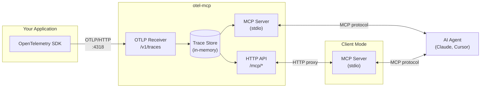

# otel-mcp

[](https://www.npmjs.com/package/otel-mcp)
[](https://github.com/moondef/otel-mcp/actions/workflows/ci.yml)
[](https://opensource.org/licenses/MIT)

MCP server that gives AI agents access to your application's OpenTelemetry traces.


https://github.com/user-attachments/assets/c6200bda-af79-42c7-9442-11c31c8cb8b5


```
Agent calls: list_traces { has_errors: true }

Recent Traces (2 of 847)

TRACE ID          SERVICE        DURATION     SPANS  ERRORS  ROOT
a]b7f2e9d4c8      checkout-api      2.34s        12       1  POST /checkout
f3e1a8b2c6d9      checkout-api      1.87s         8       1  POST /checkout

Agent calls: get_trace { trace_id: "a]b7f2e9d4c8" }

Trace ab7f2e9d4c8

Services: checkout-api, inventory-service, postgres
Duration: 2.34s
Spans: 12, 1 error

SPAN TREE
----------------------------------------------------------------
[2.34s] POST /checkout
  [1.92s] OrderService.create
    [1.87s] InventoryService.reserve  ← HTTP 500
      [45ms] POST inventory-service/reserve
    [23ms] pg.query SELECT * FROM products...
  [412ms] PaymentService.charge
    [401ms] stripe.charges.create
```

The agent can query traces, find errors, identify slow operations - without you copying logs into chat.

## Why This Exists

AI agents can read code, but they can't see how it executes. When debugging locally, you end up checking traces yourself and explaining what you found. That's the bottleneck.

otel-mcp removes that step by letting agents query execution data directly.

**Read more:**
- [How to Give AI Agents Access to Runtime Traces](https://samko.io/writings/runtime-traces-for-ai-agents/) — practical guide
- [Why AI Development Tools Must Be Execution-Aware](https://samko.io/writings/execution-aware-ai-tools/) — the design principle

## Architecture



**Primary mode**: First instance runs the OTLP receiver and MCP server. Traces are stored in memory with LRU eviction.

**Client mode**: Additional instances detect the primary via health check and proxy MCP tool calls over HTTP. Multiple AI agents can share the same trace data.

## Quick Start

**Prerequisites**: Node.js 18+

### 1. Add to your MCP client

<details open>
<summary>Cursor</summary>

Go to **Cursor Settings** → **MCP** → **Add new global MCP server** and paste:

```json
{
  "mcpServers": {
    "otel": { "command": "npx", "args": ["otel-mcp"] }
  }
}
```

Or add to `~/.cursor/mcp.json` directly.
</details>

<details>
<summary>Claude Code</summary>

```bash
claude mcp add otel -- npx otel-mcp
```
</details>

<details>
<summary>Other MCP clients</summary>

Add to your MCP config:
```json
{
  "mcpServers": {
    "otel": { "command": "npx", "args": ["otel-mcp"] }
  }
}
```
</details>

### 2. Try it out

Run the example app to generate test traces:

```bash
# Clone and run example
git clone https://github.com/moondef/otel-mcp.git
cd otel-mcp/examples/node-app
npm install && npm start
```

Then ask your AI agent: *"Show me recent traces"* or *"Are there any errors?"*

### 3. Instrument your app

Point your OpenTelemetry exporter at `http://localhost:4318/v1/traces`:

<details>
<summary>Node.js</summary>

```typescript
import { NodeSDK } from '@opentelemetry/sdk-node';
import { OTLPTraceExporter } from '@opentelemetry/exporter-trace-otlp-http';
import { getNodeAutoInstrumentations } from '@opentelemetry/auto-instrumentations-node';

const sdk = new NodeSDK({
  traceExporter: new OTLPTraceExporter({
    url: 'http://localhost:4318/v1/traces',
  }),
  instrumentations: [getNodeAutoInstrumentations()],
});
sdk.start();
```
</details>

<details>
<summary>Python</summary>

```python
from opentelemetry.exporter.otlp.proto.http.trace_exporter import OTLPSpanExporter
exporter = OTLPSpanExporter(endpoint="http://localhost:4318/v1/traces")
```
</details>

<details>
<summary>New to OpenTelemetry?</summary>

OpenTelemetry is a standard for collecting traces from applications. A trace shows the path of a request through your system - which functions ran, how long each took, what failed.

Getting started: [Node.js](https://opentelemetry.io/docs/languages/js/getting-started/nodejs/) · [Python](https://opentelemetry.io/docs/languages/python/getting-started/) · [Go](https://opentelemetry.io/docs/languages/go/getting-started/) · [Java](https://opentelemetry.io/docs/languages/java/getting-started/)
</details>

## Tools

| Tool | Description |
|------|-------------|
| `list_traces` | List recent traces. Filter by `service`, `has_errors`, `min_duration_ms`, `since_minutes`. |
| `get_trace` | Get span tree for a trace ID (prefix match supported). |
| `query_spans` | Search spans with `where` expressions: `duration > 100`, `status = error`, `http.status_code >= 400`. |
| `get_summary` | Service overview with trace counts and recent errors. |
| `clear_traces` | Clear all collected traces. |

## Multiple sessions

Multiple MCP clients share the same traces. First instance runs the collector on port 4318, others connect to it. Filter by `service` to focus on specific apps.

## Configuration

| Variable | Default | Description |
|----------|---------|-------------|
| `OTEL_MCP_PORT` | 4318 | Collector port |
| `OTEL_MCP_MAX_TRACES` | 1000 | Max traces to retain |
| `OTEL_MCP_MAX_SPANS` | 10000 | Max spans to retain |

## License

MIT
